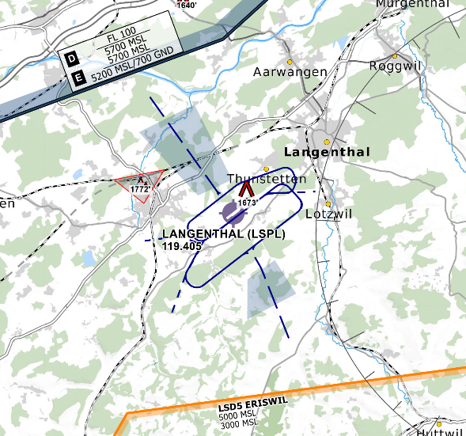

# AIRAC MBTiles Generator

This repository provides a Python-based workflow to generate MBTiles files for aeronautical charts based on AIRAC cycles. It supports **manual runs** and **scheduled automated runs** aligned with the 28-day AIRAC cycle.

The source of the tiles are from https://openflightmaps.org

The workflow also publishes generated MBTiles as **GitHub Releases**.


> **_INFO:_** Check the latest release at https://github.com/diaznet/ofm2mbtiles/releases/latest

---

## Features

- Generate MBTiles for specified bounding boxes and zoom levels.
- Pipeline for multiple regions and zoom levels via a JSON configuration.
- Automatic detection of the current AIRAC cycle.
- Pipeline aligned with AIRAC cycle dates.
- Automatic creation of MBTiles as releaes.

---

## Why ?

OpenFlightMaps releases its data via MBTiles archives, but they do not provide in their archive the highest level of zoom.

The highest level of zoom displays traffic patterm for some airports in some countries. Therefore I ahev developped this repository to be able to generate MBTiles on demand, for selected countries, for selected levels of zoom.



You can then import the MBTiles files in your favorite app.

For example, I use the excellent [SDVFR  Next](https://skydreamsoft.fr/fr_FR/page/sdvfr-next-app) and import the highest level of zoom as an overlay in my planning / navigation app:


---

## Repository Structure

```
.
├── OFM2MBTiles.py          # Main tile generation script
├── utils.py                # AIRAC and region helper functions
├── pipeline-config.json    # Regions and zoom levels configuration
├── mbtiles/                # Output folder for generated MBTiles
├── .github/
│ └── workflows/
│ └── publish-airac.yml     # GitHub Actions workflow
├── requirements.txt        # Python dependencies
└── README.md               # This file
```

---

## Installation

1. Clone the repository:

```bash
git clone https://github.com/diaznet/ofm2mbtiles.git
cd ofm2mbtiles
```

2. Install Python dependencies:

```bash
python -m pip install --upgrade pip
pip install -r requirements.txt
```

---

## Configuration
### Regions

Regions and zoom levels are defined in `pipeline-config.json` file. Example

```json
[
  {
    "oaci_prefix": "LS",
    "bbox": [5.96, 45.82, 10.49, 47.81],
    "zoom": [7, 12]
  },
  {
    "oaci_prefix": "ED",
    "bbox": [5.87, 47.27, 15.04, 55.08],
    "zoom": [12, 12]
  }
]
```

* `oaci_prefix`: Identifier for the region.
* `bbox`: Bounding box [min_lon, min_lat, max_lon, max_lat].
* `zoom`: Zoom range [min_zoom, max_zoom].

### AIRAC Cycle

Can be provided manually as an input (workflow_dispatch) or computed automatically for scheduled runs.

The first AIRAC reference date is set in utils.py.

```python
FIRST_AIRAC_DATE = datetime(2025, 1, 23, tzinfo=timezone.utc)
```

## Usage
### Manual Run

Trigger the GitHub Actions workflow manually:

Go to Actions → Publish AIRAC MBTiles → Run workflow

Specify:

* airac_cycle (optional, defaults to latest)
* bbox (required for manual runs)
* zoom (required for manual runs)
* oaci_prefix (required for manual runs)

The workflow will run, generate MBTiles and publish them in the Releases.

### Automated Scheduled Run
Runs daily at midnight UTC.

Checks if the current date matches the 28-day AIRAC cycle using utils.py is_start().

If yes, generates MBTiles for all regions defined in pipeline-config.json.

Skips execution if it’s not an AIRAC start date.

## Development & Debugging

### `utils.py` Commands

```bash
# Show current AIRAC cycle
python utils.py airac

# Check if today is an AIRAC start date
python utils.py is_start

# List all regions
python utils.py regions

# List region prefixes
python utils.py region_names

# List future AIRAC cycles
python utils.py future
```

### Generating MBTiles Locally

```bash
python OFM2MBTiles.py \
  --bbox 5.96 45.82 10.49 47.81 \
  --zoom 7 12 \
  --airac 2510 \
  --oaci-prefix LS
```


## Author

Jeremy Diaz
